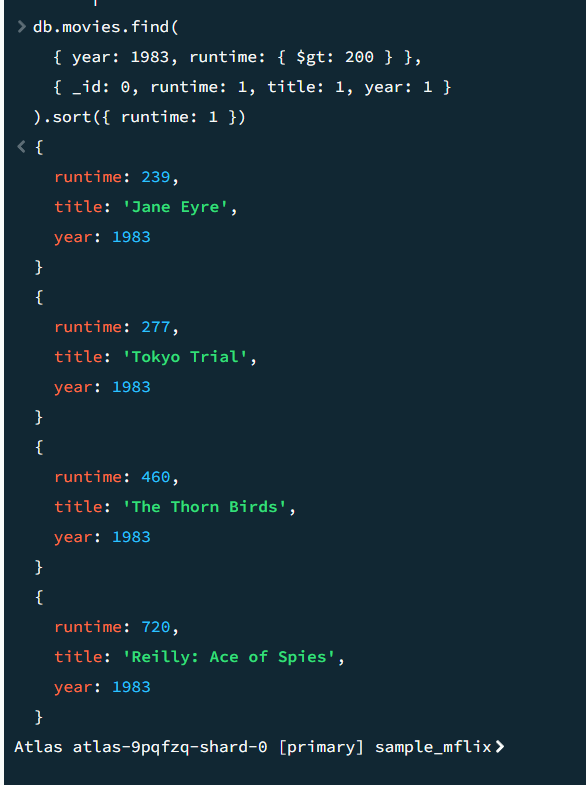
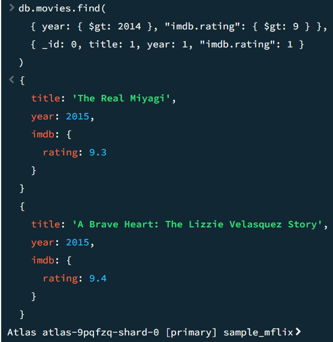

# Assignment 3: MongoDB Setup and Queries

## Overview
This assignment is an introduction into MongoDB Atlas and running search queries in MongoDB Compass.


This repository contains:
- `README.md` - assignment documentation, including code and screenshots of search queries and their results
- `Query1.png` - image of search query 1 and its results
- `Query2.png`- image of search query 2 and its results


## Query 1
Find all movies with `runtime` > 200 minutes in `year` 1983,
sort by `runtime` ascending,
and return only `runtime`, `title`, and `year`.

The query is as follows:

```javascript
db.movies.find(
  { year: 1983, runtime: { $gt: 200 } },
  { _id: 0, runtime: 1, title: 1, year: 1 }
).sort({ runtime: 1 })
```

A screenshot of this query and its results are below.




## Query 2
Find all movies after `year` 2014 with `imdb rating` greater than 9.

The query is as follows, returning only `title`, `year`, and `imdb rating`:

```javascript
db.movies.find(
  { year: { $gt: 2014 }, "imdb.rating": { $gt: 9 } },
  { _id: 0, title: 1, year: 1, "imdb.rating": 1 }
)
```

A screenshot of this query and its results are below.


